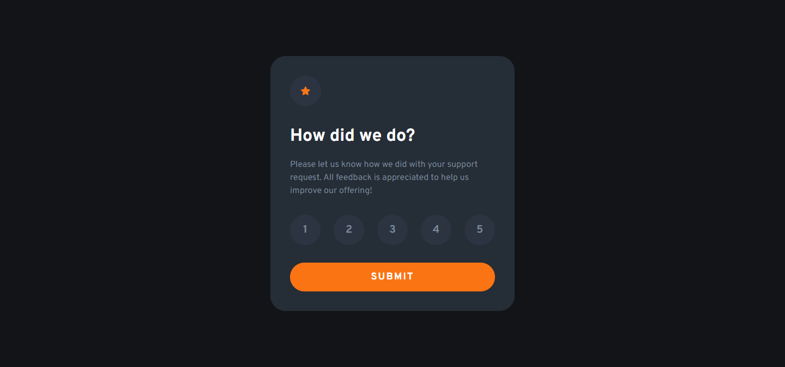

# Frontend Mentor - Interactive rating component solution

This is a solution to the [Interactive rating component challenge on Frontend Mentor](https://www.frontendmentor.io/challenges/interactive-rating-component-koxpeBUmI). Frontend Mentor challenges help you improve your coding skills by building realistic projects. 

## Table of contents

- [Overview](#overview)
  - [The challenge](#the-challenge)
  - [Screenshot](#screenshot)
  - [Links](#links)
- [My process](#my-process)
  - [Built with](#built-with)
  - [What I learned](#what-i-learned)
  - [Continued development](#continued-development)
  - [Useful resources](#useful-resources)
- [Author](#author)s


## Overview

This challenge was great practice for basic DOM manipulation. This is the first challenge I've attempted from Frontend Mentor that has some JavaScript functionality. It was a little challenging since I just learned the basics of accessing the DOM (at the time of attempting this challenge). There is so much to unpack from events to elements, node lists,  attributes and so much more. It is very overwhelming for a beginner but I bet I'll have a lot of fun learning about DOM manipulation and interesting ways to solve problems. This also means that I'm one step closer to building the fancy websites I admire 

### The challenge

Users should be able to:

- View the optimal layout for the app depending on their device's screen size
- See hover states for all interactive elements on the page
- Select and submit a number rating
- See the "Thank you" card state after submitting a rating

### Screenshot

Desktop View



Mobile view is pretty much the same

### Links

- Solution URL: [My Frontend Mentor Profile](https://www.frontendmentor.io/profile/dxiDavid)
- Live Site URL: [Go Live](https://interactive-rating-card-component.pages.dev/)

## My process

The styling on the card was pretty straight forward. What took up most of my time was adding the functionality required for the card to actually work. After hours of trying different approaches to the problem and googling my way through, I finally settled on a solution. The code is full of comments for now but I'm not too worried about it.

### Built with

- Semantic HTML5 markup
- CSS custom properties
- Flexbox
- Vanilla JavaScript


### What I learned

- I learned how to use the ```document.querySelectorAll()``` method to create a list of nodes
- I learned how to access each node using the ```forEach()``` method and change it with an event listener. The method was confusing at first but I eventually understood what was happening
- I learned how to add and remove classes from an element using an event listener.

### Useful resources

- [Youtube](https://www.youtube.com/@KevinPowell) - This is where I found the best tutorials and explanations (For me) on CSS concepts and      writing functional CSS. Kevin Powel really knows his stuff and gives concise explanations.
- [w3schools](https://w3schools.com) - This website has an entire course on JavaScript with simple examples for both basic and advanced concepts.
- [CSS Tricks](https://css-tricks.com/) - This website provides very well written explanations to CSS concepts as well as examples for when you need to revisit a concept.
- [mdn](https://developer.mozilla.org/en-US/) - Always helpful to read the documentation of any language.

## Author

- Frontend Mentor - [@dxiDavid](https://www.frontendmentor.io/profile/dxiDavid)
- Twitter - [@dxidavid254](https://www.twitter.com/dxidavid254)

